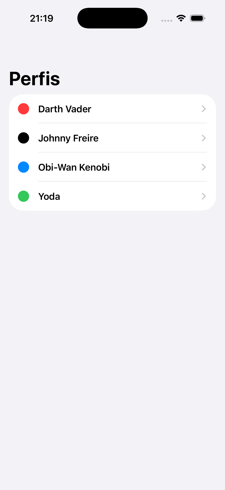

# ListIteratorsApp

## Description
This is a simple iOS application that demonstrates the use of lists and iterators in Swift/SwiftUI.

## Features
- Displaying a list of items.
- Detailed view for each item.

## How to Run
1. Open the `ListIteratorsApp.xcodeproj` file in Xcode.
2. Select a simulator or a physical device.
3. Build and run the application.

## Screenshots

